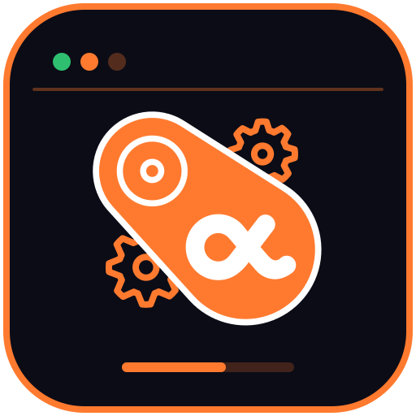
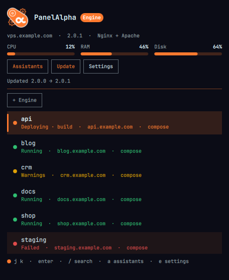

<p align="center"></p>

<h3 align="center">PanelAlpha Watch</h3>

<p align="center">
  
  
  
  
  
  
  <a href="LICENSE"></a>
</p>

<p align="center"></p>

PanelAlpha Engine in your Omarchy bar. One icon and one panel show the projects on your servers, their deploys and the server load, with buttons for the everyday actions. It needs no daemon and no SSH, only the engine URL and an API token.

#### Features

- **Projects:** the list with a coloured state for each project, its domains, containers, databases and deploy phases
- **Actions:** redeploy, cancel a deploy, restart, stop, start, suspend, unsuspend, open the site, delete
- **Logs:** the deploy log, the app log, and a check that the app answers
- **Server:** CPU, RAM and disk, and a one-button engine update
- **Several engines:** add, switch, edit and remove them from the panel
- **AI assistants:** create, revoke and delete MCP tokens, copy the connect command for your assistant, and see what the assistants did
- **Alerts:** a dot on the bar icon when a project fails or deploys, and notifications for deploys, suspended projects, and RAM or disk running out
- **Terminal:** every project action and the engine update also run from `omarchy-shell`

#### Requirements

- Omarchy with its shell (`omarchy-shell`)
- A PanelAlpha Engine you can reach from this machine, usually on port 2011
- An API token from `pae api:token:create` on that engine

#### Quick start

```bash
omarchy plugin add git@github.com:wiluszdamian/omarchy-engine-watch.git --enable --yes
```

The shell loads the plugin right away and puts the icon in the bar.

On the server, create a token:

```bash
pae api:token:create watch
```

Click the PanelAlpha icon in the bar, enter the engine URL (for example `https://your-vps.example:2011`) and the token, then press **Save**.

#### Documentation

- [Installation and configuration](docs/installation.md): updating, several engines, certificates, notifications, troubleshooting
- [Usage](docs/usage.md): the panel, AI assistant tokens, keyboard shortcuts, terminal commands
- [API and security](docs/api.md): the routes the plugin calls and how it handles the token

#### Development

```bash
node tests/run.js
omarchy plugin validate .
```

The tests cover the logic in `Model.js` and `Api.js`. `Service.qml` polls the engine and runs the actions, `Panel.qml` is the panel, and `BarWidget.qml` is the bar icon.

License: [MIT](LICENSE).
